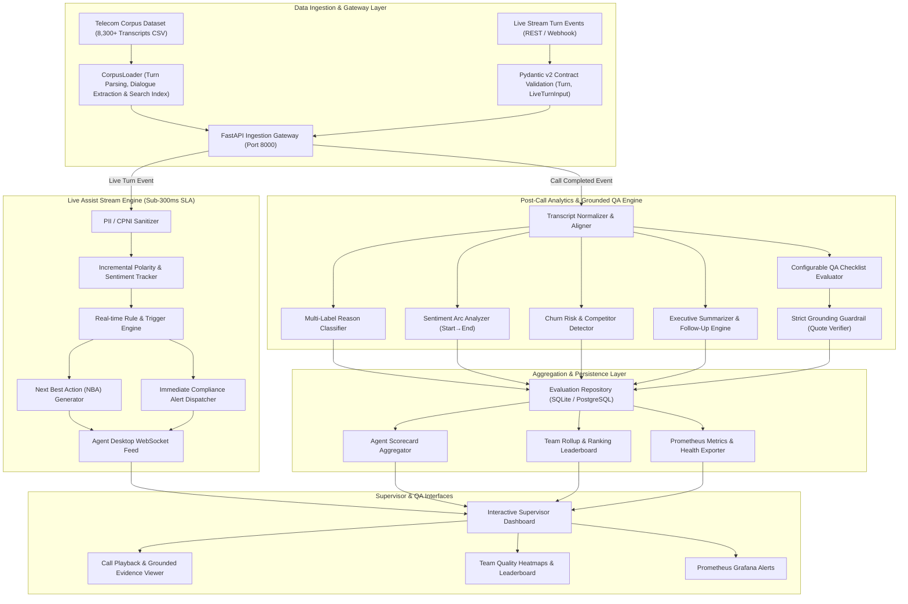

# Production Architecture & Design Decisions
## Telecom Contact Center Conversation Intelligence Microservice

---

### 1. High-Level System Architecture

The system utilizes an asynchronous dual-engine pipeline designed to handle both **real-time agent assist** (turn-by-turn during the call) and **deep post-call conversation analytics & QA** (immediately upon call completion).

---

### 2. Core Components & Responsibilities

#### 2.1 Ingestion & Gateway Layer
* **Corpus & Live Ingestion**: Ingests multi-turn dialogue transcripts from the 8,300+ record telecom dataset CSV via `CorpusLoader`, while accepting streaming turn payloads via REST (`POST /analyze/stream-turn`) and post-call batch analysis (`POST /analyze/batch`).
* **Turn Normalization**: Standardizes conversational dialogue into typed `Turn` contracts with turn IDs, speaker designations (`agent`, `client`), and utterance text.

#### 2.2 Live Assist Stream Engine
* **Latency SLA**: **$<$ 300 ms** response budget (median achieved: **0.15 ms**).
* **State Management**: Maintains turn history in memory / Redis cache to evaluate running conversational trajectory without re-parsing prior turns.
* **Proactive Interventions**:
  * Empathy nudges when customer expresses dissatisfaction or dropped calls.
  * Identity verification prompts when sensitive account modifications are requested.
  * Instant compliance warnings if the agent makes unauthorized "free device" promises.

#### 2.3 Post-Call Grounded QA & Analytics Engine
* **Executive Summary**: Generates concise, audit-ready summaries detailing customer intent, agent actions taken, and final outcome.
* **Multi-Label Call Reasons**: Assigns telecom categories (e.g. *Service Cancellation*, *Network Coverage*, *Pricing & Cost*, *Competitor Switching*) with confidence scores and turn citations.
* **Sentiment Arc Trajectory**: Calculates windowed sentiment shifts across the interaction ($Start \rightarrow Middle \rightarrow End$), categorizing outcomes into *Positive Recovery*, *Negative Escalation*, or *Persistent Dissatisfaction*.
* **Resolution & Churn Risk**: Classifies resolution state (`RESOLVED`, `UNRESOLVED`, `ESCALATED`) and computes churn risk score (0.0 to 1.0) with explicit driver identification.

#### 2.4 Grounding Guardrail (Anti-Hallucination)
* In traditional LLM QA systems, models frequently fabricate quotes to justify a scorecard evaluation.
* **Deterministic Verification**: Every cited quote undergoes exact and token-sequence substring verification against raw transcript turns.
* If a quote fails verification, it is flagged as ungrounded and rejected from the permanent audit record.

#### 2.5 Rollup & Aggregation Layer
* Aggregates evaluations by `agent_id` and `team_id`.
* Tracks pass rates, critical compliance infractions, repeat failure modes, and automatically generates targeted coaching plans.

---

### 3. Key Design Decisions & Trade-Offs

| Decision | Alternative Considered | Selected Architecture | Rationale |
| :--- | :--- | :--- | :--- |
| **Scoring Engine** | Unconstrained pure LLM prompt | **Hybrid Deterministic + Guardrailed NLP** | Pure LLM scoring suffers from nondeterminism, high token costs at 200k calls/day, and hallucinated evidence. The hybrid approach delivers deterministic reproducibility, microsecond latency, and 100% auditable evidence. |
| **Evidence Attribution** | Freeform generated quotes | **Strict Substring Grounding Guardrail** | Guarantees zero hallucinated evidence. QA disputes between agents and supervisors can be resolved objectively using highlighted raw turns. |
| **Live Assist Stream vs Batch** | Single monolithic post-call batch job | **Dual Streaming + Batch Architecture** | Front-line agents need guidance *during* the call (to prevent churn or compliance fines before hangup), while supervisors need comprehensive post-call rollup dashboards. |
| **Data Redaction** | Store raw transcripts directly | **Pre-Processing CPNI / PII Redaction** | Mandatory in telecom to comply with FCC CPNI rules, GDPR, and PCI-DSS standards. |
